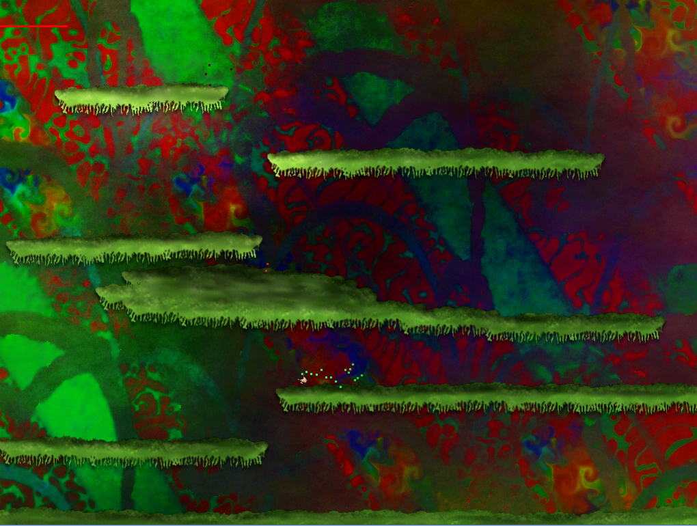

duckling
========

This is a weird platform game sandbox without a goal.

It's a little Python program I slapped together back in May 2004.

* Version: 0.1
* License: MIT
* Author: Alexander Rødseth <rodseth@gmail.com>
* Last updated: July 2013

Use the arrow keys to move and space to fire.

* Requires Python 2 and Pygame.
* Can use the Psyco module.
* Has particle effects.

Screenshots
-----------

